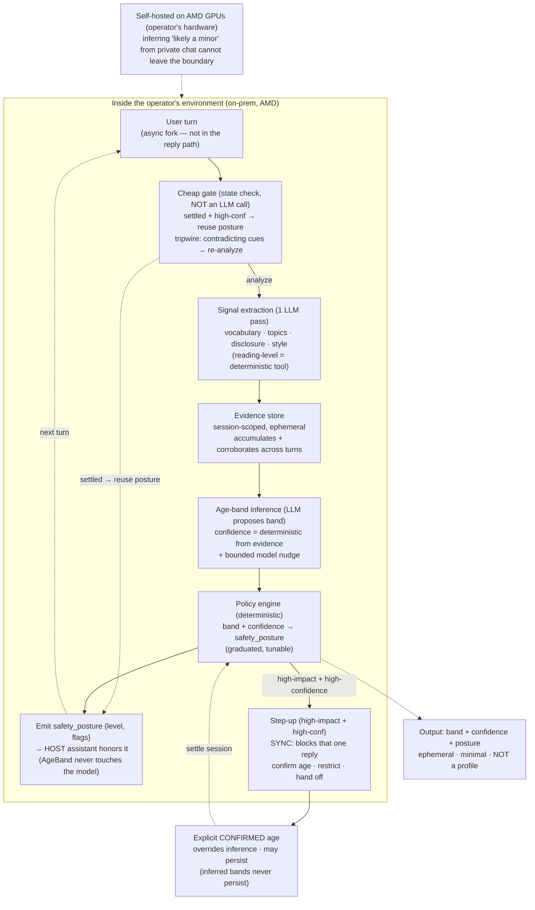

# AgeBand

*A passive age-band signal inferred from conversation — driving graduated, confidence-aware safety in AI chat products. It runs on the operator's own hardware (on-prem), because inferring whether a user is a minor from their private messages is far too sensitive to send to a third-party API.*

---

## The problem

AI chat products are under real, growing pressure to protect minors — and the tools they have are crude. In almost every product, "age" is a birthdate typed once at signup, which any child clicks straight through. After that, the product has no idea who it's actually talking to, and it applies the same behavior to a 12-year-old and a 40-year-old.

The signal the product is ignoring is right there in front of it: **how the user writes and what they talk about.** A child and an adult use language differently, reference different parts of their lives, and raise different topics. Senior trust-and-safety people can read a transcript and form a strong impression of who they're talking to in seconds — but that judgement isn't automated, isn't always-on, and doesn't scale to millions of concurrent conversations.

## What it does (and what it deliberately does not)

AgeBand reads the conversation as it flows and maintains a live, probabilistic estimate of the user's **age band** — likely-child, likely-teen, likely-adult, or unknown — with a **confidence level**. That signal drives graduated safety: the less sure the product is that it's talking to an adult, the more protective its behavior becomes.

What it is careful *not* to do is as important as what it does:

- It does **not** claim a precise age. Text is a noisy signal; the honest output is a band and a confidence, never "you are 14."
- It does **not** hard-block on a guess. A low-confidence signal quietly tightens safety; only a strong, corroborated signal triggers a step-up.
- It does **not** build a profile. The output is ephemeral and minimal — band, confidence, recommended setting — not a stored dossier. It's a **safety signal, not surveillance.**

Framed correctly, this is the difference between "protects kids" and "profiles users," and AgeBand is built to land firmly on the first side.

## How it works

**Cheap gate first, full inference rarely.** Running LLM inference on every turn of every conversation would be needless and expensive — once a session is settled ("adult, high confidence" by a few turns in), later turns don't need re-analysis. So every turn hits a cheap gate first. The gate is *not* itself an LLM call: it's a state check over stored session state (band, confidence, turn count) plus an **always-on heuristic tripwire** — a cheap keyword/pattern scan that runs even on settled sessions and forces re-analysis the moment contradicting cues appear. That tripwire is what handles the case that would otherwise break this design: a settled "adult" session where the device is handed to a child mid-conversation. Full inference runs when evidence is thin, the band is unknown or low-confidence, or the tripwire fires; otherwise the settled posture stands. This is what makes "always-on" affordable rather than a slogan — cheap on every turn, expensive only when it matters.

**Signal extraction (one pass).** When the gate says analyze, AgeBand reads the turn for age-relevant cues — vocabulary and complexity, topics (school, guardians, curfews), explicit statements ("I'm in 8th grade"), and interaction style — in a single structured extraction, with the countable pieces (reading level) as deterministic tool calls. No forms, no interruption.

**Evidence accumulation.** Rather than guessing from one message, AgeBand accumulates cues across the conversation in session-scoped, ephemeral state. It starts at *unknown* and only moves as cues corroborate, so a single ambiguous message doesn't swing it.

**Age-band inference with grounded confidence.** An LLM reasons over the accumulated evidence and proposes a band with the specific cues it relied on — explainable, not a black box. Crucially, **confidence is mostly deterministic**: it's derived from countable, grounded facts (how many corroborating cues, how strong, whether an explicit disclosure is present), with the LLM contributing only a bounded adjustment. LLM-emitted confidence scores are notoriously uncalibrated, so we don't let the model hand us a raw 0.9 — we compute confidence from evidence and let the model nudge it.

**Graduated policy (deterministic).** A deterministic policy engine — not the LLM — maps band + confidence to a `safety_posture`. The model *estimates*, the policy *decides*, and the mapping is auditable and tunable. Low confidence quietly tightens filters; higher confidence escalates proportionally.

**Cold-start posture.** On the first turns, before evidence exists, the band is *unknown* and only universally-safe defaults apply — neither wide open nor locked down. Protection tightens as evidence accumulates, so a new adult isn't frustrated and a new child isn't exposed on turn one.

**Async by default, synchronous on the high-severity edge.** AgeBand runs *beside* the reply, not inside it, so it adds no latency to the vast majority of turns. But that has a consequence worth stating plainly: because it runs in parallel, on the exact turn a child first reveals themselves the assistant has often *already answered* under the old posture — there's a one-turn lag. For gradual tightening that lag is harmless. For a hard-stop it is not. So the resolution isn't "async everywhere": it's **async by default, but a high-severity transition (a strong child signal crossing the step-up threshold) blocks that one reply** until the new posture is applied. The common case stays fast; the one turn that actually matters is allowed to wait.

**Step-up as the real backstop.** When a high-impact protection is warranted, AgeBand steps up — asks the user to confirm their age, restricts a feature, or hands off — rather than acting silently on a guess. Explicit confirmation always overrides the inference. This matters more than it looks: inference alone **cannot** be a security boundary against a motivated liar (see limits below), so step-up/verification is where the real assurance lives.

**Errs safe, and asks rather than restricts.** Because the response is graduated, a wrong low-confidence guess only tightens safety a little or *asks* — it never silently locks someone out. The system deliberately biases toward *ask* over *restrict*, because asking is recoverable and silent restriction (which falls hardest on non-native speakers and people who write simply) is not.

## Architecture

The parts, each with one job:

- **Signal extractor** — pulls age-relevant cues from each turn. Cheap, runs every message.
- **Evidence store** — session-scoped and ephemeral; accumulates cues so the estimate is stable, not twitchy. Nothing persisted as a profile.
- **Age-band inference (LLM)** — reasons over the evidence, returns band + confidence + the cues it used. Can and does say *unknown*.
- **Policy engine (deterministic)** — the model estimates, this decides. Maps band + confidence to a graduated `safety_posture`; fully auditable and tunable per product.
- **Enforcement (via a posture contract)** — AgeBand does *not* reach into the model. It emits a `safety_posture` object — a level plus a set of flags (content-filter level, feature allow/deny, tone profile) — and the host assistant is responsible for honoring it. AgeBand is a signal *producer*; the host is the *enforcer*. That boundary keeps AgeBand from touching the reply path and makes the interface concrete.
- **Step-up** — only for high-impact actions and only at high confidence; asks rather than assumes. Explicit confirmation overrides everything. This, not inference, is the assurance backstop.
- **Orchestration (planner-supervisor)** — the pipeline above is *not* hardcoded. A planner-supervisor agent iteratively decides the next action each turn (plan → act → observe → re-plan): does this turn need re-extraction, more evidence, a decision, or a step-up? It makes the open-ended judgment calls a fixed sequence can't. Crucially, the planner chooses the *route*, not the safety *outcome*: it can only *request* deterministic actions, and the orchestration layer rejects any attempt to emit a posture directly, skip or reorder the safety guards, take confidence from the LLM, or persist an inferred band — failing closed, with a bounded iteration cap. Agentic where judgment helps; deterministic where safety demands.

## What to build

A focused, demoable slice — the goal is to show the *graduated, confidence-aware* behavior, not a perfect classifier.

**Seed the scenario.** Four short scripted conversations: one clearly adult, one clearly a young teen (school, guardians, simple vocabulary), one genuinely ambiguous (an adult who writes simply, or a non-native speaker), and — the important one — **one adversarial: a child actively claiming to be an adult**, avoiding childlike language and dodging revealing topics. Define a small policy table mapping band × confidence → posture.

**Build the pipeline.**
1. **Cheap gate** — per turn, decide whether full inference is needed (thin/unknown/low-confidence/contradicted) or the settled posture stands. Most turns short-circuit here.
2. **Signal extractor** — one structured LLM pass pulling age-relevant cues, with reading-level as a deterministic tool.
3. **Evidence store** — accumulate cues across the conversation in session-scoped, ephemeral state.
4. **Age-band inference** — LLM proposes {band, cited cues}; confidence computed deterministically from the evidence with a bounded model nudge; starts at *unknown*.
5. **Policy engine** — deterministic table maps band + confidence → a `safety_posture`, with a step-up threshold.
6. **Enforcement + UI** — the host honors the `safety_posture`; a live side panel shows band, confidence, the evidence behind it, and the active posture, updating turn by turn.

The steps above aren't wired as a fixed sequence: a **planner-supervisor** decides which to run next each turn and loops until a posture is emitted or a step-up is raised — but it can only *request* the deterministic safety steps (confidence, policy, posture, persistence), which run behind precondition checks that fail closed.

**The demo moment.** Run the conversations side by side. The adult stays open. The young-teen one watches confidence climb as school and guardian references stack up, safety tightening step by step until it steps up and asks to confirm age. The ambiguous one is the fairness money shot: confidence *stays low*, so AgeBand tightens only slightly and **asks** rather than locking anyone out. And the adversarial one is the crux — the child claiming to be an adult: instead of being fooled, AgeBand treats the evasion itself as a weak signal (the over-insistence, the dodged topics), keeps confidence from settling on "adult," and routes to the **step-up** — showing exactly where inference hands off to verification. *"It doesn't guess your age and slam a door. It gets more careful the more it suspects a child, it asks before it assumes — and when someone games it, it stops guessing and asks."*

**Stack.** Open-weight LLM (Llama/Qwen-class) served on AMD GPUs via ROCm, or via the Fireworks API; a lightweight session store for accumulated evidence; a deterministic policy table; a small web UI showing the live band, confidence, evidence, and active safety setting.

> **Config flip for the inverse use case:** a kids' product wanting to detect *adults* who slip in uses the same pipeline — only the policy table changes (a likely-adult signal in a children's space triggers protection instead of a likely-minor signal in an adult one).

## Why it runs on AMD

Inferring whether a user is a minor from their private messages is about the most sensitive attribute you could compute from the most sensitive data a product holds. It is legally and ethically impossible to ship that to a third-party API — the inference has to run **on-prem, inside the operator's own environment, on the operator's own hardware.** (To be precise: this is server-side, in the operator's datacenter — not on the user's device.) Self-hosting isn't a compute story here; it's the entire deployability story. And even with the cheap-gate design, always-on inference over many concurrent conversations is a real throughput load that wants serious GPUs.

## Design decisions & known limits

Being straight about the hard parts, because they're where this gets judged — and naming them is a strength, not a weakness.

**It is a risk-reduction signal, not an access-control guarantee.** Passive inference works on a *cooperative* user. A determined child will lie — claim to be older, avoid childlike language, dodge revealing topics — and passive text signals degrade against that. So AgeBand does two things: it treats evasion itself as a weak signal (abrupt style shifts, over-insistence on being an adult), and, more importantly, it leans on the **step-up/verification path as the actual backstop.** Inference narrows the field and decides *when* to ask; it is not claimed to catch a motivated liar on its own. Anyone who pitches passive age inference as airtight is overselling; we don't.

**The session-vs-identity tension is real, and only *confirmed* facts persist.** Keying everything to an ephemeral `session_id` protects privacy but is trivially defeated by starting a new session. Linking cues across sessions would rebuild the profile we promised not to keep. The distinction that resolves it is **confirmed vs. inferred**: raw cue evidence and any *inferred* band stay session-scoped and ephemeral and are never persisted; only an **explicitly confirmed age** (ground truth the user gave us at a step-up) may persist, and only against the product's *existing* account identity — never one AgeBand invents. A silently inferred "this account is a child" flag would itself be the sensitive profile, so we never store one. Where there's no account and no confirmation, each session genuinely starts fresh — an accepted limitation, and the right side of the privacy line to err on.

**Cross-language is a real weak spot, so lexical signal is down-weighted.** The lexical cues (vocabulary, reading level) collide directly with the fairness goal: a non-native adult and a native child can look nearly identical on exactly those signals. We don't claim the model cleanly separates them. Instead, lexical signal is explicitly weighted *below* explicit disclosure and topic signals, and the ask-don't-restrict bias absorbs the rest. This is a mitigation, not a solution — stated honestly.

**False positives are asymmetric, so we bias toward asking.** Wrongly restricting an adult — especially a non-native speaker or someone who writes plainly — is a real harm that likely correlates with demographics. The graduated design plus the *ask-don't-restrict* bias is the mitigation, and fairness monitoring is a first-class loop: every step-up that resolves to "actually an adult" is a labeled false positive that feeds threshold tuning.

**Confidence is grounded, not vibes.** Because LLM self-reported confidence is uncalibrated, the number that drives protection is computed from countable evidence (corroborating cues, disclosure present, cue strength), with only a bounded model adjustment.

**Thresholds are tuned, not fixed.** Any specific numbers here (confidence buckets, how many turns to "settle") are illustrative — they're tuned empirically per product and jurisdiction, not hard constants.

**One model to start.** The "small model for extraction, larger for estimation" split is an optimization, not a requirement — it adds serving complexity (two resident models). The lean build uses **one open-weight model for both calls**, and only splits if profiling justifies it.

**Policy config is trusted input.** The policy table and product mode are treated as signed/trusted configuration, not an arbitrary MCP response — if that config were attacker-influenceable, the safety behavior could be inverted.

**The careful shell is load-bearing, not decoration.** The deepest honest point: everything rests on the premise that age band is meaningfully inferable from chat text, and that core signal is genuinely uncertain and demographically uneven. The graduated, ask-first, ephemeral, confirmed-only design isn't polish around a strong core — it's precisely the *right* engineering response to a *weak* core. The care is the point.

**Scope honesty (what we'd actually build first).** Stripped to essentials this is *two LLM calls* (extract, estimate) wrapped in deterministic plumbing (gate, evidence, policy, enforce), routed by a guardrailed planner-supervisor. The full module map shows the thinking; the lean "as-built" tab is what ships first, and we grow into the modules only where load and real-world failure justify them.

## Glossary (one term per concept, used throughout)

- **estimate** — the model's proposed age band + cited cues (the LLM's output). Not "inference/guess/read" elsewhere.
- **confidence** — the deterministic 0..1 score computed from evidence. Bucketed (low/med/high) only inside the policy engine.
- **posture** (`safety_posture`) — the `{level, flags}` object AgeBand emits and the host honors. Not "action/setting/mode" elsewhere.
- **confirmed vs. inferred** — *confirmed* = user-provided ground truth (persistable against an existing account); *inferred* = model estimate (always ephemeral).
- **settled** — a session whose band is high-confidence, so the gate skips inference unless the tripwire fires.
- **planner-supervisor** — the runtime agent that iteratively decides the next action per turn (plan → act → observe → re-plan). Chooses the route, never the safety outcome; the deterministic guards fail closed.

## Why it wins

Every AI chat product needs child safety, and today they're stuck with a birthdate field a kid ignores. AgeBand gives them a passive, always-on, privacy-preserving signal from the conversation itself — the thing that's actually missing. The design is what makes it credible where naive "age detection" fails: **bands not precise ages, graduated responses not hard blocks, ask-don't-assume at the boundary, ephemeral signals not profiles, and step-up as the real backstop.** That's the difference between a compliance liability and a feature a platform can actually ship — and the on-prem-on-AMD requirement isn't a bolt-on, it's the only way something this sensitive is allowed to exist.

> **A passive age-band signal from the conversation that gets more protective the more it suspects a child — and asks before it assumes. On-prem, because this is far too sensitive to run anywhere else.**
