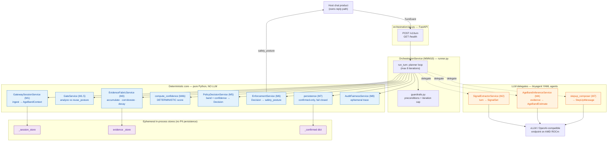
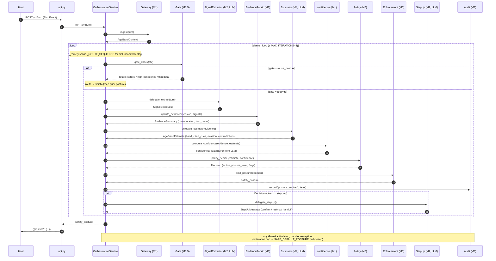
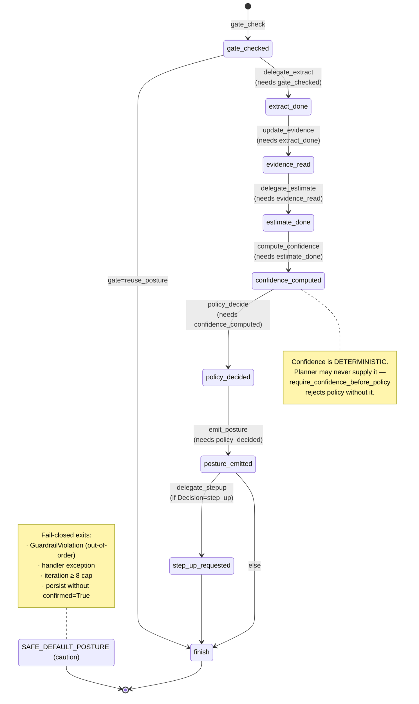
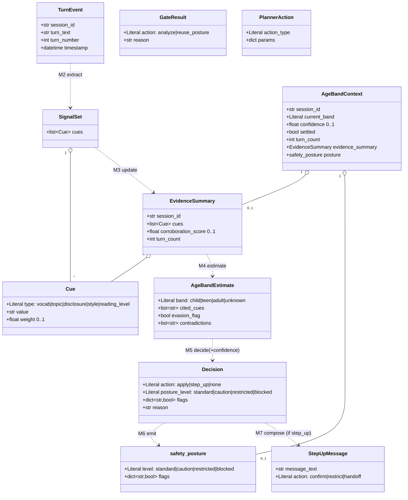
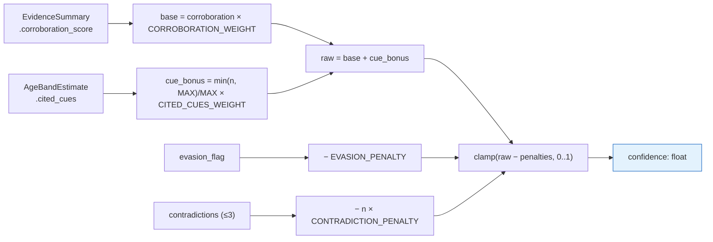

# AgeBand — Architecture Diagrams

Auto-generated from a read of `src/`. Four views:

1. [Component architecture](#1-component-architecture) — modules, LLM vs deterministic split
2. [Call flow](#2-call-flow-run_turn-sequence) — `run_turn` planner loop (sequence)
3. [Planner routing state machine](#3-planner-routing--guardrail-state-machine) — ordered pipeline + guardrails
4. [Data models](#4-data-models-class-diagram) — Pydantic contracts

---

## 1. Component architecture

> **Key invariant shown:** the LLM only *estimates* (M2, M4, M7-compose). Every *decision* — confidence, policy, posture, persistence — is deterministic Python. `safety_posture` flows back to the host; AgeBand never touches the reply path.
>
> **Note on the lean build:** in `runner.py` the delegate handlers (`_handle_extract`, `_handle_estimate`, `_handle_stepup`) use an injected `_mock_delegates` seam or safe defaults — the standalone `SignalExtractorService` / `AgeBandInferenceService` are the production LLM path they stand in for.

---

## 2. Call flow: `run_turn` (sequence)

---

## 3. Planner routing & guardrail state machine

Each turn runs an ordered pipeline. `_route()` picks the next action from the first
unset `PlannerState` flag; `enforce_preconditions()` blocks any out-of-order action.

---

## 4. Data models (class diagram)

Pydantic v2 models from `contracts/models.py` (all `extra="forbid"`).

### Confidence derivation (deterministic, `ageband_inference/confidence.py`)

